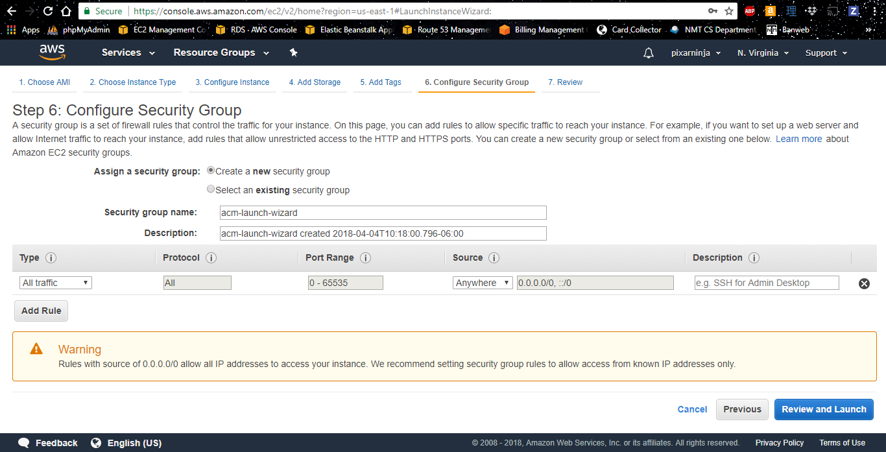
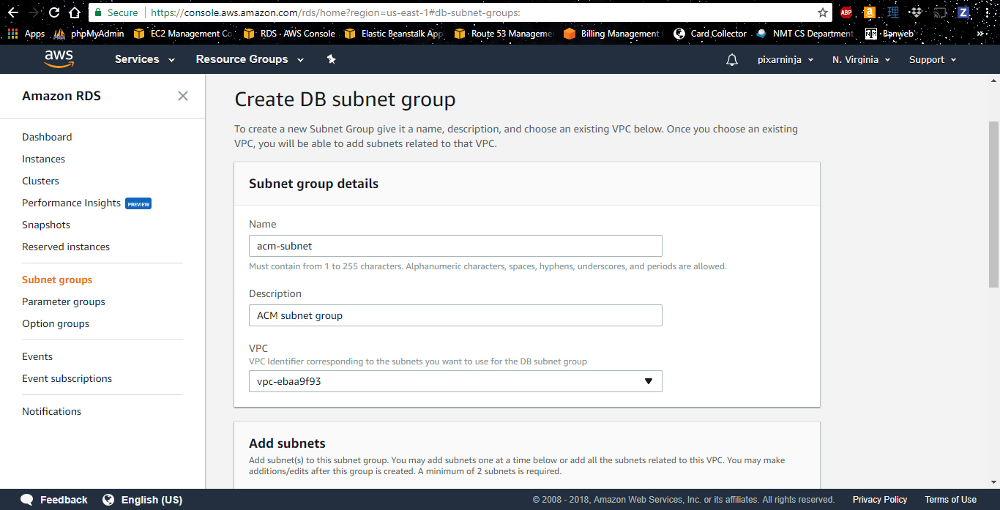
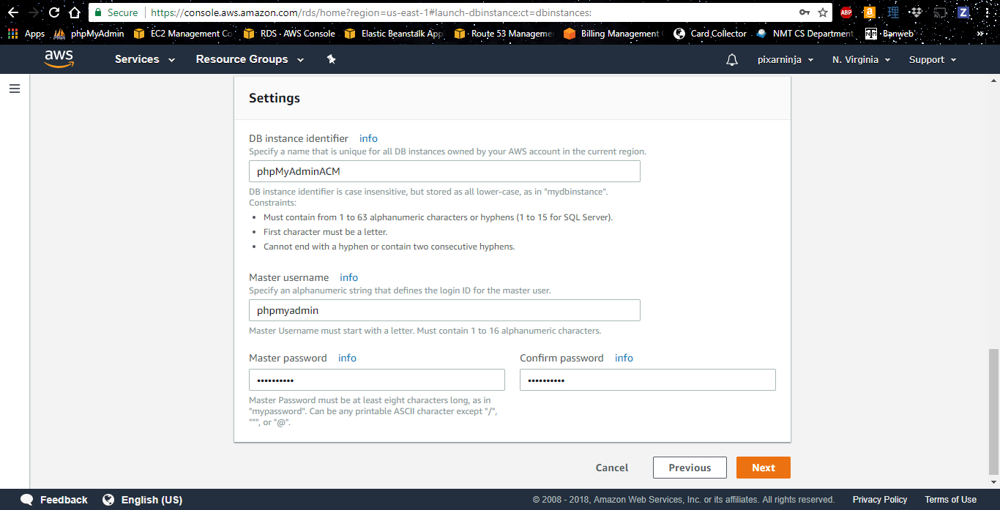
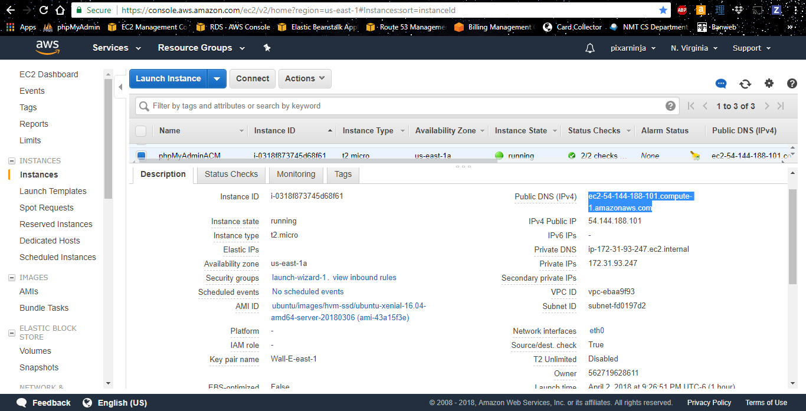
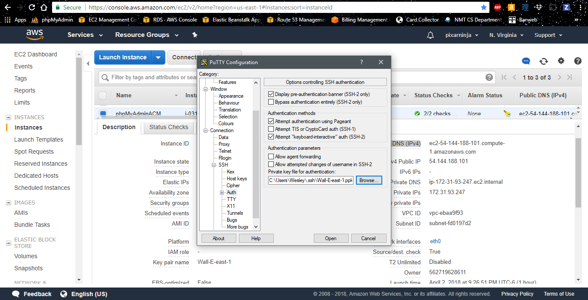
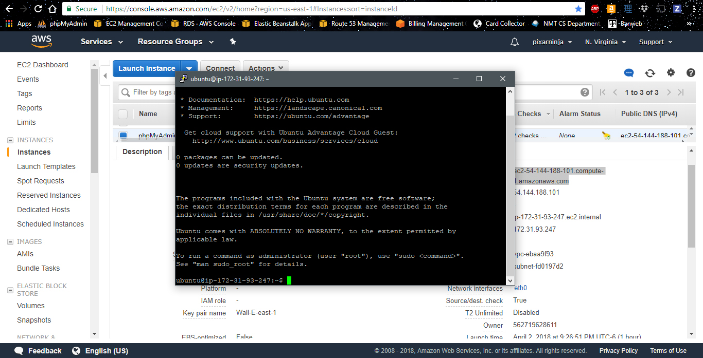
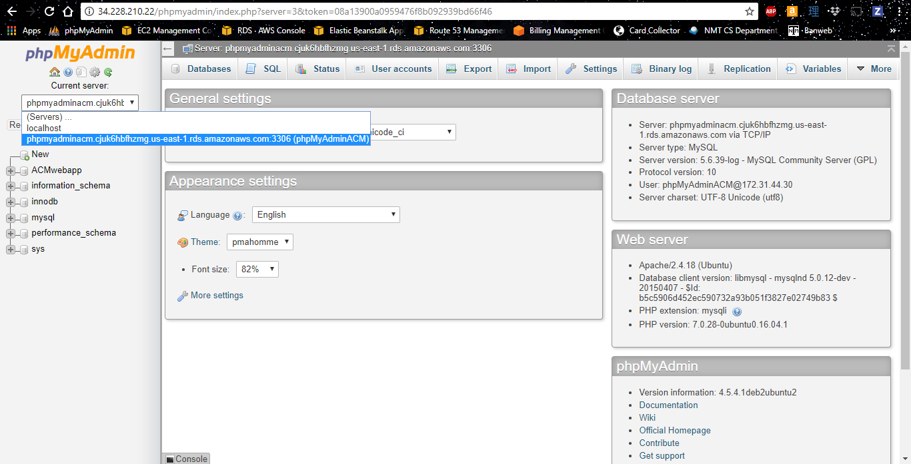
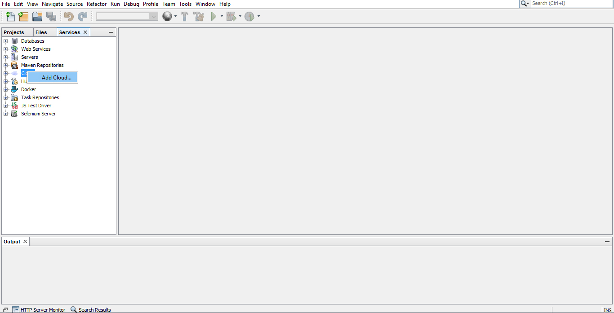

# NMT ACM Webapp Demonstration

## Abstract

This repo contains source files for the web application demonstration given at the ACM chapter of NMT. Topics I plan to cover during the demonstration are listed below:
- MVC Architecture
- Java Servlets
- Java Beans
- JSP/HTML
- SQL Databases
- PhpMyAdmin
- Basic Password Encription

## Code Snippets

Below I've included some helpful code snippets that describe what needs to be added to the code base when working with JSP, servlets, and Java beans. I will use these snippets in my demonstration to help save time, and it should also help viewers to follow along.

### Servlets

Java servlets are what handle requests for your webpage. Code can be automattically generated for them in NetBeans, by clicking the "Servlet..." option when creating a new file. In order to send or receive requests, a servlet needs to at least have the doGet and doPost servlet methods implemented; this is usually where we will add our servlet code. These methods are called mainly from JSP forms. 

A basic doPost method is produced below. You should think about the differences between GET and POST methods before deciding which to implement code in.

```java
@Override
protected void doPost(HttpServletRequest request, HttpServletResponse response)
        throws ServletException, IOException {
    String action = request.getParameter("action"); // used to know how to treat the request
    int myVariable = 0;
    if(request.getParameter("my_variable") != null) {
        myVariable = Integer.parseInt(request.getParameter("my_variable")); // example for retrieving a variable from JSP
    }
    String url = "/";
    if(action.equals("my_action")) {
        try {
            String driver = "com.mysql.jdbc.Driver"; // the MySQL Driver you're using
            Class.forName(driver); // open the driver
            String dbURL = "jdbc:mysql://your-db-instance-endpoint";
            String user = "your-db-user";
            String pass = "your-db-password";
            Connection connection = DriverManager.getConnection(dbURL, user, pass);

            url = "/print.jsp"; // set the JSP file to go to, given there were no errors
        } catch (ClassNotFoundException ex) {
            url = "/index.jsp";
            request.setAttribute("error", ex);
            Logger.getLogger(MyServlet.class.getName()).log(Level.SEVERE, null, ex);
        } catch (SQLException ex) {
            url = "/index.jsp";
            request.setAttribute("error", ex);
            Logger.getLogger(MyServlet.class.getName()).log(Level.SEVERE, null, ex);
        }
    }
    /* take us to the specified URL */
    RequestDispatcher dispatcher = request.getRequestDispatcher(url);
    dispatcher.forward(request, response);
}
```

### Java Beans

Java beans (despite the odd name) are very useful, and an integral part of the MVC architecture. The main purpose of a Java bean is to store data from the database into a Java object, keeping all the sensitive backend data (such as passwords or data) out of reach from users of the application.

```java
package beans; // for organization purposes

import java.io.Serializable;
import java.sql.*;
import java.util.LinkedHashMap;
import java.util.Iterator;
import java.util.Map;
import java.util.logging.Level;
import java.util.logging.Logger;

public class MyBean implements Serializable{
    
    private static LinkedHashMap beansById = new LinkedHashMap(); // map of MyBean classes
    private Connection connection;
    
    private String id; // private DB variables (columns in the DB)
    
    public MyBean() { // an empty constructor is needed if this class is a Java bean
        try {
            beansById = new LinkedHashMap();
            String driver = "com.mysql.jdbc.Driver"; // the MySQL Driver you're using
            Class.forName(driver); // open the driver
            String dbURL = "jdbc:mysql://your-db-instance-endpoint";
            String username = "your-db-user";
            String password = "your-db-password";
            connection = DriverManager.getConnection(dbURL, username, password); // open the connection
        
            Statement statement = connection.createStatement();

            ResultSet rs = statement.executeQuery("SELECT * FROM `MyTable`"); // SELECT data from a table in the DB
            while(rs.next()) { // must call rs.next() at least once, to grab the first row of data
                String id = rs.getString("id"); // create local DB variables and initialize them from data in the DB
                
                beansById.put(id, new MyBean(/* store the data saved from the DB variables in a constructor*/));
            }
            rs.close();
            connection.close();
        } catch (ClassNotFoundException ex) { // catch Driver errors
            Logger.getLogger(MyBean.class.getName()).log(Level.SEVERE, null, ex);
        } catch (SQLException ex) { // catch SQL errors
            Logger.getLogger(MyBean.class.getName()).log(Level.SEVERE, null, ex);
        }
    }
```

### JSP

JSP (JavaServer Pages) is pretty much HTML augmented with Java. The main purpose of JSP is to help us procedurally generate web pages on the fly, by loading in data from our Java beans or directly from the database (which can be insecure!). Below is a code snippet that is placed at the top of a JSP page, which is used to initialize a Java bean.

```jsp
<%@page import="beans.*"%> // import all of our Java beans
... // other imports
<jsp:useBean id="myBean" class="beans.beanSource" scope="request"/> // import a Java bean, notice there are no '%'!
```

Before we start our main body of HTML code we might want to import another JSP page, such as a JSP header. This can be accomplished using the snippet below.

```jsp
<%@include file="jsp_file.jsp"%>
```

After importing a Java bean, we can use it later in the JSP code, just like in Java.

```jsp
<%
    MyClass myClass = myBean.getBeanById(id); // grabs an element from the MyClass list inside of myBean
%>
```

We can also retreive data sent from our Java servlets, using getParameter (set by JSP) or getAttribute (set in the servlet).

```jsp
<%
    String item = null;
    if(request.getParameter("item") != null) { // check if the item is a parameter
        item = request.getParameter("item")); // returns a String
    }
    else if(request.getAttribute("item") != null) { // check if the item is an attribute
        item = (String)request.getAttribute("item"); // returns an Object, we should cast to String
    }
%>
```

Similarly, we can send requests to our Java servlets by using forms. This is very important in the MVC architecture, since it creates fewer entry points for malicious attacks.

```jsp
<form id="myForm" action="MyServlet" method="POST">
    <input type="hidden" name="action" value="my_action">
    <input type="hidden" name="my_variable" value="<%=my_JSP_variable%>">
    <button type="submit">Submit Form</button>
</form>
```

If the form does not have a button submission, then we can create it without the button tag and submit (for example) by a link instead.

```jsp
<p align="center">
    <a onclick="document.getElementById('myForm').submit();">
        Submit Form
    </a>
</p>
```

### Web.xml

For each Java servlet added to the project, we must add servlet and servlet-mapping tags for it in the web.xml file. This file is usually stored in the WEB-INF/ directory inside of NetBeans. I've copied a very basic web.xml file below.

```xml
<?xml version="1.0" encoding="UTF-8"?>
<web-app version="3.1" xmlns="http://xmlns.jcp.org/xml/ns/javaee" xmlns:xsi="http://www.w3.org/2001/XMLSchema-instance" xsi:schemaLocation="http://xmlns.jcp.org/xml/ns/javaee http://xmlns.jcp.org/xml/ns/javaee/web-app_3_1.xsd">
    <display-name>SiteName</display-name>
    <servlet>
        <servlet-name>MyServlet</servlet-name>
        <servlet-class>MyServlet</servlet-class>
    </servlet>
    <servlet-mapping>
        <servlet-name>MyServlet</servlet-name>
        <url-pattern>/MyServlet</url-pattern>
    </servlet-mapping>
</web-app>
```

## Backend Setup Resources

Since the demonstration time is only an hour, I won't be able to cover how to create the backend of the application. Below are links to resource material on the setup of the backend portion of the web application. I've also taken screen shots and explained the steps I used to create the backend. All of the backend is hosted by AWS (Amazon Web Services). You must first create an account with AWS to use it, however this is not ellaborated on in the walkthrough.

### Links

- [EC2 Console (us-east-1)](https://console.aws.amazon.com/ec2/v2/home?region=us-east-1)
- [RDS Console (us-east-1)](https://console.aws.amazon.com/rds/home?region=us-east-1)
- Tutorial: [Creating EC2 and RDS instances for phpMyAdmin](https://www.youtube.com/watch?v=Bz-4wTGD2_Q)
- Tutorial: [Linking Elastic Beanstalk to Netbeans](https://blog.idrsolutions.com/2015/10/how-to-set-up-amazon-cloudaws-elastic-beanstalk-on-the-netbeans-ide/)

### Walkthrough

#### phpMyAdmin: Setting Up EC2

EC2 is a server creation service we will use to launch a phpMyAdmin interface. To get started, open the EC2 Console via the following link: [https://console.aws.amazon.com/ec2/home?region=us-east-1](https://console.aws.amazon.com/ec2/home?region=us-east-1). This console is the basic interface for AWS EC2 managment. Notice that there is a place to change where on Earth the services are hosted from in the top right corner as a drop-down menu. I've selected North Virgina (corresponding to us-east-1) since it is an option built into Netbeans cloud services.
  
Select "Instances" from the menu on the left side to bring up all of your EC2 instances. The console will load all of your EC2 instance information (if you are running any instances). Click on the "Launch Instance" button, then proceed with the following steps:

- On the following page, press "Select" on the Ubuntu Server 16.04 LTS (HVM), SSD Volume Type option. You may also select the checkbox near the top of the page that will only show Free Tier options.
- Under the instance types, choose the t2.micro instance (which is Free Tier eligible).
- Proceed to "5. Add Tags", and give the instance a name. I used the key "Name" with a value "phpMyAdminACM".
- Continue to the next step, "6. Configure Security Group", and ensure that there is a rule with the type "All traffic" and source "Anywhere", as shown below. I also named the security group "acm-launch-wizard" and updated the description to make it easy to find.



- Now click the "Review and Launch" button.
- Select the "Launch" button.
- You will need to create and/or use a generated key pair to access your instance. If you create one, *you will not have access to the private key once you download it from EC2! Be sure to store it in a safe location.*
- Now select "Launch Instances", and the EC2 instance will be launched!

If you go to your launched EC2 instances, you should see a new instance (if it does not have a name, you can hover over that section and select to edit it. I gave mine "phpMyAdminACM" since the server will host phpMyAdmin for us).

#### Database: Setting Up RDS

RDS is the database service we will use to store and retreive data. To get started, open the RDS Console via the following link: [https://console.aws.amazon.com/rds/home?region=us-east-1](https://console.aws.amazon.com/rds/home?region=us-east-1). This console is the basic interface for AWS RDS managment. Again, notice that there is a place to change where on Earth the services are hosted from in the top right corner as a drop-down menu. I've selected North Virgina (corresponding to us-east-1) since it is an option built into Netbeans cloud services.

Before launching an instance, we first want to setup a Subnet Group. Select "Subnet groups" from the menu on the left-hand side. Click the "Create DB Subnet Group" button on the resulting page, and then proceed with the following steps:

- Give the subnet a name and a description. Something along the lines of "phpMyAdmin" would work well (or more specific if you think you'll launch multiple phpMyAdmin servers; I used "acm-subnet").



- The VPC should be selected, however you can change it if you've created any others
- Click the "Add all subnets related to this VPC" button, and then select "Create".

This should create for you a new subnet group with the name you specified. Now we can continue on to create the RDS DB instance.

Select "Instances" from the menu on the left side to bring up all of your RDS instances. Then select "Launch DB Instance" and proceed with the following steps:

- Click on MySQL as the engine type, then click "Next".
- From the different use cases, choose "Dev/Test - MySQL". This is because we want to be within the Free Tier limitations.
- Under "DB instance class" subsection select from the dropdown menu "db.t2.micro". This is, again, by Free Tier limitations. If possible, check the box under the popup disclaimer for Free Tier, as shown below.
- Fill in the bottom text boxes with appropriate names/passwords. I chose the identifier/username "phpMyAdminACM". Leave the rest of the default settings on this page as is.



- Leave the default VPC, which is the one configured with our subnet group.
- Choose the subnet we created as the "Subnet group".
- Under "VPC security groups" choose the security group we created before.
- Leave the default settings on the next page except for the "Database name" section; give the database instance a name, I chose "ACMwebapp".
- Click "Launch DB Instance" to finish creating your RDS instance!

After performing the above steps, you should have a working Free Tier RDS instance.

### Connecting EC2 and RDS

Now that we have all the ground-work laid, we need to install phpMyAdmin on our EC2 server and connect it to the RDS database. To do this, you must first SSH into the EC2 instance. Since I'm on Windows I use PuTTY, and my process is described below.

- Open the instances page under the EC2 console.
- Select your instance, and then copy the Public DNS (IPv4) information, as highlighted below.



- Open PuTTY. In the "Host Name (or IP Address)" box, type "ubuntu@" and then paste the copied address. ubuntu is the defualt username for EC2 Ubuntu servers. You can also save this information for easy access.
- Under the "Category" list on the left side of PuTTY, expand "SSH" and click "Auth".
- Click the "Browse" button, and select the private key that you created along with your EC2 instance. It's customary to save this key under ~/.ssh, however this is not always necessary. *You may have to convert the file you downloaded to PEM format in order to use it.*



- Now select "Open" to launch the connection. You should be logged into your EC2 instance.



Taken from [andrewpuch/phpmyadmin_connect_to_rds](https://github.com/andrewpuch/phpmyadmin_connect_to_rds/blob/master/README.md), the instructions for installing phpMyAdmin on the EC2 server (once SSH'd inside) are reproduced below. Run all the commands listed, and edit the files as described.

You can copy the following commands as a block and run them in the terminal.

```
sudo su
apt-get update
apt-get upgrade -y
apt-get dist-upgrade -y
apt-get autoremove -y
```
Now we must setup the phpMyAdmin service. Once the following command is run, you will be prompted with an interface that will walk you through setting up phpMyAdmin.

```
apt-get install apache2 php7.0 php7.0-cli php7.0-fpm php7.0-gd php-ssh2 libapache2-mod-php7.0 php7.0-mcrypt mysql-server php7.0-mysql git unzip zip postfix php7.0-curl mailutils php7.0-json phpmyadmin -y
```
During setup, ensure the following.

- Choose a password for the MySQL root user.
- Select "No configuration" for mail.
- Select "apache2" for the default configuration server.
- Click "yes" when prompted for DB configuration.
- Choose a password for the phpMyAdmin root user on the resulting page. This username is automatically set to "phpmyadmin".

Continue with the following instructions.

```
phpenmod mcrypt

vim /etc/apache2/sites-enabled/000-default.conf
--ADD LINE AT THE TOP-- 
Include /etc/phpmyadmin/apache.conf

service apache2 restart
```

You should now be able to access the phpMyAdmin interface using the IPv4 Public IP address found under the public DNS address we used before. If you copy that IP address into a browser followed by "/phpmyadmin" you will be taken to the phpMyAdmin interface. Then you can log into it with the username you chose (I chose "root") and the phpMyAdmin password you created. The RDS instance won't be connected, however, so continue with the rest of these commands/instructions to connect EC2 with RDS.

If this link doesn't work, you should check your Security Groups under the EC2 console. Select the acm-launch-wizard security group (you can find out which security group is attached to your instance under the EC2 instance details) and check that all traffic is being let through. You should now be able to access the phpMyAdmin interface and login with the phpMyAdmin password you created before. The RDS instance won't be connected, however, so continue with the rest of these commands/instructions to connect EC2 with RDS.

```
vim /etc/phpmyadmin/config.inc.php
--ADD LINES BELOW THE PMA CONFIG AREA (ABOVE LINE 109) AND FILL IN DETAILS--
$i++;
$cfg['Servers'][$i]['host']          = '__FILL_IN_DETAILS__';
$cfg['Servers'][$i]['port']          = '3306';
$cfg['Servers'][$i]['socket']        = '';
$cfg['Servers'][$i]['connect_type']  = 'tcp';
$cfg['Servers'][$i]['extension']     = 'mysql';
$cfg['Servers'][$i]['compress']      = FALSE;
$cfg['Servers'][$i]['auth_type']     = 'config';
$cfg['Servers'][$i]['user']          = '__FILL_IN_DETAILS__';
$cfg['Servers'][$i]['password']      = '__FILL_IN_DETAILS__';
```

The host will be the RDS endpoint, which is the link we set aside earlier (or you can get it from the instance information in the RDS console). The user is the administrative username set for the RDS instance, and similarly the password is the password that was set for this user. Once this information is saved, we will have the RDS DB accessible from phpMyAdmin via the dropdown, as demonstrated below.



### Webserver: Creating an Elastic Beanstalk instance

Now that all the plumbing is done, we should setup the cloud environment for launching our web application. We will use Elastic Beanstalk (again from AWS) in order to launch our application, since it will setup the Tomcat webserver backend for us automatically. In order to manage the EB instance, we must first create a User for the instance to link to. This is done in a different AWS service, called IAM: [https://console.aws.amazon.com/iam/home?region=us-east-1](https://console.aws.amazon.com/rds/home?region=us-east-1). If you already have created a user and their credentials downloaded, then you may proceed to the EB instance setup. Otherwise, follow the steps below:

- Under the "Users" tab, select the "Add user" button.
- Name the user; I chose the name "nmtacm". Give the user at least Programmatic Access.
- Create the permission group "admin" with policy "AdministrativeAccess", or use a group with that policy.
- Review the information and create the user.

Once the user is created, you will need to download and store the credentials somewhere accessible. *This is the last time you can access these credentials!*

To setup EB, open the Elastic Beanstalk Console via the following link: [https://console.aws.amazon.com/elasticbeanstalk/home?region=us-east-1](https://console.aws.amazon.com/rds/home?region=us-east-1). This console is the basic interface for AWS Elastic Beanstalk managment. Again, notice that there is a place to change where on Earth the services are hosted from in the top right corner as a drop-down menu. I've selected North Virgina (corresponding to us-east-1) since it is an option built into Netbeans cloud services.

Select "Create New Application" from the upper right hand corner of the page, and then follow the steps below.

- Give the application a name. I named mine "nmtacmwebdemo".
- Click the "Create Webserver" button.
- Under "Predefined configuration" select "Tomcat" and "Single instance" from the dropdown menus.
- Under "Deployment Preferences" section, use the dropdown menu to select "All at once" instead of "Rolling".
- Under the environment information, configure a name that you would like to see in the URL. I used "nmtacmwebdemo". There are more steps you can take after setting up this application instance to obtain your own URL, however I will not ellaborate on those here.
- Select the checkbox for "Create this environment inside a VPC"; we will configure this later.
- Fill in the key and email address, then proceed to the next step.
- Proceed to the next page, since we don't need to add any environment tags.
- The VPC information should be pulled in for the default VPC. Select all of the available subnets. Also ensure that the correct subnet group is selected at the bottom of the page.
- If none are available, you'll need to create a new service role. If there are already service roles present, proceed to the next step.
- Review the information, then click "Launch" to launch the webserver.

It will take several minutes for AWS to create the environment. After the environment has been created, EB will be ready to launch an application. We will setup NetBeans to do this for us below.

### Launching to EB from NetBeans

In order to connect EB and NetBeans, we must setup our EB instance under the "Cloud" in NetBeans. You can add a cloud by going to the Services tab in NetBeans, and then right click on the Cloud and select "Add Cloud...".



Now follow the steps below to finish setting up the cloud:

- Select "Amazon Beanstalk" as the cloud option, and give the cloud a name that will be used to identify it in NetBeans.
- Select the region where the EB instance is hosted. As noted above, I chose North Virginia because it's an option in NetBeans.
- Input the Access Key ID and Secret Access Key that we saved with the user we created.
- Select "Finish" once the keys have been verified.

You should now be able to launch a NetBeans application, by chaning the Server Settings of the NetBeans project to the newly created EB cloud addition. This ends the Walkthough of the backend setup of this repository.
